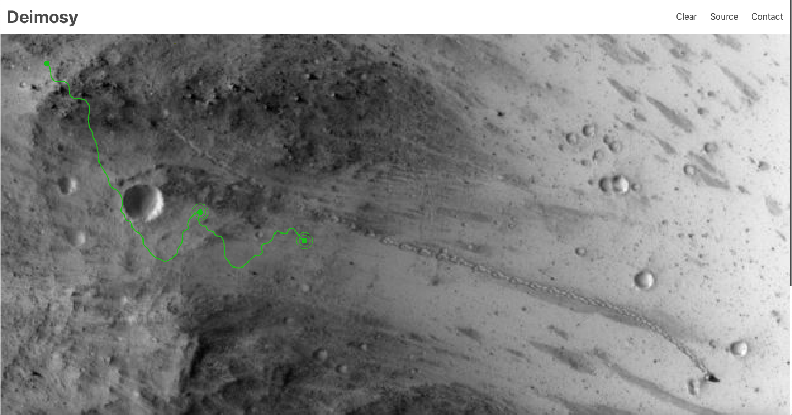

# Deimosy

### Video Presentation:

Coming soon...

### Deployed Web App:

https://deimosy.herokuapp.com

### Description:

Named after the smaller and outermost of the two moons of the planet Mars, Deimosy is a pathfinding simulator web app for probes navigating the surface of Mars.

In its core, Deimosy relies on a rendition of the A\* search algorithm that calculates the cost of a step based on the absolute value of the difference between the weight of a given node and that of its neighbor, with the weight of a node being the equivalent of its altitude.

MVP completed in 4 days for a solo project.

### Tech Stack:

Built using Python and Flask on the backend, TypeScript, React, and Bulma on the frontend, and utilizes python-pathfinding and P5.js.

### Dev Team:

- Tal Luigi ([LinkedIn](https://www.linkedin.com/in/tal-luigi) | [GitHub](https://github.com/luigilegion))
